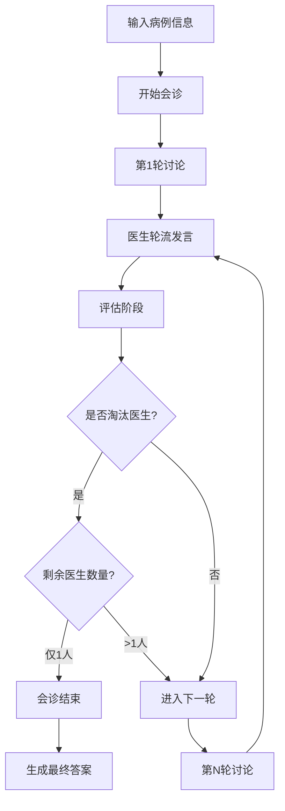

# AI 妇产科多专家会诊系统

<div align="center">

一个基于 Vue 3 + Pinia 开发的纯前端妇产科专科 AI 多专家会诊系统

[](LICENSE)
[](https://vuejs.org/)
[](https://antdv.com/)

</div>

## 📖 项目简介

AI 妇产科多专家会诊系统是一个针对妇产科领域的创新智能会诊平台，通过集成多个大语言模型（LLM）模拟不同亚专科方向的妇产科专家，实现多专家协同诊断。系统采用纯前端架构，无需后端服务器，直接在浏览器中调用各大 AI 服务商的 API。

**专科特色**：
- 🤰 **高危妊娠管理**：妊娠期高血压、糖尿病、胎盘异常等
- 🔬 **妇科肿瘤诊疗**：子宫颈癌、卵巢癌、子宫内膜癌等
- 💊 **生殖内分泌**：月经失调、多囊卵巢、不孕不育等
- 🏥 **产科急症识别**：异位妊娠、胎盘早剥、产后出血等
- 🔍 **妇产科影像解读**：B超、阴超、胎儿超声等


### ✨ 核心特性

- 🏥 **妇产科多专家协作**：支持添加多个由不同 LLM 驱动的妇产科专家参与会诊，覆盖高危妊娠、妇科肿瘤、生殖内分泌、妇科微创、产科急症等多个亚专科方向
- 🤖 **多模型支持**：集成 OpenAI、Anthropic Claude、Google Gemini、硅基流动、魔搭社区等主流 AI 模型
- 💬 **实时讨论**：医生轮流发言，支持打字机效果展示
- 🗳️ **智能评估**：医生互相评估彼此的诊断，自动淘汰不准确的意见
- 📋 **妇产科专病采集**：月经史、婚育史、既往妇科病史等专科化病例采集
- 🖼️ **妇产科影像识别**：支持B超、阴超、宫腔镜等影像资料的AI识别与分析
- 📊 **状态监控**：实时显示会诊阶段、轮次、医生状态等信息
- 💾 **会话管理**：自动保存会诊记录，支持多个问诊会话切换
- ⚠️ **急症风险识别**：特别关注异位妊娠、胎盘早剥、产后出血等产科急症
- 💊 **妊娠期用药安全**：治疗建议特别注意妊娠期和哺乳期用药安全
- 🎨 **美观界面**：基于 Ant Design Vue 设计，界面简洁直观
- 📱 **纯前端**：无需服务器，所有数据保存在浏览器本地存储

## 🚀 快速开始

### 环境要求

- Node.js >= 16.0.0
- pnpm >= 9.0.0（推荐）或 npm

### 安装步骤

1. **克隆项目**

```bash
git clone <repository-url>
cd ai-medical-consultation-panel
```

2. **安装依赖**

```bash
pnpm install
# 或使用 npm
npm install
```

3. **启动开发服务器**

```bash
pnpm dev
# 或使用 npm
npm run dev
```

4. **访问应用**

打开浏览器访问：`http://localhost:5173`

### 构建生产版本

```bash
pnpm build
# 或使用 npm
npm run build
```

构建完成后，产物将生成在 `dist` 目录中。

> ⚠️ 注意：生产环境默认直接向第三方 API 发起请求，如需继续通过本地代理，请在构建时设置环境变量 `VITE_ENABLE_PROXY=true`，并确保部署环境提供 `/api-proxy` 的转发能力。

## 📚 使用指南

### 第一步：配置医生

1. 点击右上角的 **"设置"** 按钮
2. 在 **"医生配置"** 标签页中添加医生：
   - 输入医生名称（例如：Dr. GPT-4）
   - 选择供应商（OpenAI规范 / Anthropic规范 / Gemini规范 / 硅基流动 / 魔搭社区）
   - 填写对应的 API Key
   - 可选：自定义 Base URL（用于代理或私有部署）
   - 选择或输入模型名称
   - 可选：自定义医生的提示词

3. 点击 **"添加医生"** 按钮添加更多医生
4. 在 **"问诊医生"** 标签页中选择参与本次会诊的医生

### 第二步：输入病例信息

1. 在主页面填写妇产科病例信息：
   - 患者姓名（必填）
   - 性别
   - 年龄
   - **月经史**：初潮年龄、月经周期、经期、末次月经等
   - **婚育史**：婚姻状况、孕产次、分娩方式、流产史等
   - **既往妇科病史**：妇科疾病史、手术史、用药史等
   - **主诉**（必填）：停经、阴道出血、腹痛、白带异常等
   - **妇产科影像资料**（可选）：B超、阴超、宫腔镜等影像

2. 点击 **"开始会诊"** 按钮

### 第三步：观察会诊过程

- 医生将轮流发言，提出自己的诊断和建议
- 每轮讨论结束后，医生们会互相评估
- 被多数医生标记为"不太准确"的医生将被淘汰
- 会诊将持续到：
  - 只剩一位医生（该医生的诊断为最终答案）
  - 连续多轮无医生被淘汰（达到设定的上限）

### 第四步：查看最终答案

会诊结束后，系统会生成一份完整的诊断总结，包括：
- 核心诊断
- 诊断依据
- 鉴别诊断
- 检查建议
- 治疗建议
- 随访计划
- 风险提示

点击 **"查看最终答案"** 按钮即可查看，还可以导出为图片保存。

## 🛠️ 技术架构

### 技术栈

- **前端框架**：[Vue 3](https://vuejs.org/) - 渐进式 JavaScript 框架
- **状态管理**：[Pinia](https://pinia.vuejs.org/) - Vue 的官方状态管理库
- **UI 组件库**：[Ant Design Vue](https://antdv.com/) - 企业级 UI 组件库
- **构建工具**：[Vite](https://vitejs.dev/) - 新一代前端构建工具
- **Markdown 渲染**：[Marked](https://marked.js.org/) - Markdown 解析器
- **HTTP 客户端**：[Axios](https://axios-http.com/) - 基于 Promise 的 HTTP 库

### 项目结构

```
ai-medical-consultation-panel/
├── src/
│   ├── api/              # API 调用模块
│   │   ├── callAI.js     # AI 模型调用封装
│   │   └── models.js     # 模型列表获取
│   ├── assets/           # 静态资源
│   ├── components/       # Vue 组件
│   │   ├── CaseInputForm.vue        # 病例输入表单
│   │   ├── ChatDisplay.vue          # 聊天记录显示
│   │   ├── DiscussionPanel.vue      # 讨论面板
│   │   ├── DoctorList.vue           # 医生列表
│   │   ├── SessionListDrawer.vue    # 会话列表抽屉
│   │   ├── SettingsModal.vue        # 设置弹窗
│   │   ├── StatusPanel.vue          # 状态面板
│   │   ├── VoteTally.vue            # 投票统计
│   │   └── VotingControls.vue       # 投票控制
│   ├── store/            # 状态管理
│   │   ├── index.js      # 会诊流程状态
│   │   ├── global.js     # 全局配置状态
│   │   └── sessions.js   # 会话管理状态
│   ├── utils/            # 工具函数
│   │   └── prompt.js     # 提示词构建
│   ├── App.vue           # 根组件
│   └── main.js           # 应用入口
├── index.html            # HTML 模板
├── vite.config.js        # Vite 配置
├── package.json          # 项目配置
└── README.md             # 项目文档
```

## 🔧 配置说明

### 支持的 AI 供应商

#### 1. OpenAI规范

- **API Key 获取**：访问 [OpenAI Platform](https://platform.openai.com/api-keys)
- **推荐模型**：
  - `gpt-4o`：最新、最强大的模型
  - `gpt-4o-mini`：更快、更经济的选择
  - `gpt-4-turbo`：高性能模型
- **Base URL**：默认为 `https://api.openai.com/v1`
- **说明**：符合 OpenAI API 规范的服务商均可使用此选项

#### 2. Anthropic规范

- **API Key 获取**：访问 [Anthropic Console](https://console.anthropic.com/)
- **推荐模型**：
  - `claude-3-5-sonnet-20241022`：最新旗舰模型
  - `claude-3-opus-20240229`：最强推理能力
  - `claude-3-haiku-20240307`：快速响应
- **Base URL**：默认为 `https://api.anthropic.com/v1`
- **说明**：符合 Anthropic API 规范的服务商均可使用此选项

#### 3. Gemini规范

- **API Key 获取**：访问 [Google AI Studio](https://aistudio.google.com/app/apikey)
- **推荐模型**：
  - `gemini-1.5-pro`：旗舰模型
  - `gemini-1.5-flash`：快速模型
- **Base URL**：默认为 `https://generativelanguage.googleapis.com/v1beta`
- **说明**：符合 Gemini API 规范的服务商均可使用此选项

#### 4. 硅基流动

- **API Key 获取**：访问 [硅基流动控制台](https://cloud.siliconflow.cn/account/ak)
- **推荐模型**：
  - `Qwen/Qwen2.5-7B-Instruct`：通义千问系列
  - `THUDM/glm-4-9b-chat`：智谱 GLM 系列
  - `Pro/Qwen/Qwen2.5-72B-Instruct`：高性能通义千问
- **Base URL**：默认为 `https://api.siliconflow.cn`
- **说明**：硅基流动是国内领先的 AI 推理加速平台，提供高性价比的模型服务
- **文档**：[硅基流动 API 文档](https://docs.siliconflow.cn/cn/userguide/introduction)

#### 5. 魔搭社区

- **API Key 获取**：访问 [魔搭社区 API-KEY](https://modelscope.cn/my/myaccesstoken)
- **推荐模型**：
  - `qwen-turbo`：通义千问 Turbo
  - `qwen-plus`：通义千问 Plus
  - `qwen-max`：通义千问 Max
- **Base URL**：默认为 `https://dashscope.aliyuncs.com`
- **说明**：魔搭社区是阿里云推出的模型即服务平台，提供丰富的国产大模型
- **文档**：[魔搭社区 API 文档](https://modelscope.cn/docs/model-service/API-Inference/intro)

### 全局设置

在设置的 **"全局设置"** 标签页中，可以配置：

- **全局系统提示词**：所有医生的默认行为指南
- **最终总结提示词**：生成最终诊断报告的指令
- **发言顺序**：随机或按医生列表顺序
- **连续未标注不太准确的最大轮数**：会诊结束条件之一

## 🎯 核心功能详解

### 会诊流程



### 评估机制

系统采用自动化的同行评审机制：

1. **评估请求**：每轮讨论后，所有在席医生对本轮的所有发言进行评估
2. **选择目标**：每位医生选择一位他认为"不太准确"的医生（可以是自己）
3. **统计结果**：获得最多"不太准确"标记的医生将被淘汰
4. **公平机制**：如果票数相同或无人获得票数，本轮不淘汰任何医生

### 数据持久化

所有数据使用浏览器的 `localStorage` 进行本地存储：

- **医生配置**：包括 API Key、模型选择等（存储在全局配置中）
- **会话记录**：每次会诊的完整记录自动保存
- **当前状态**：刷新页面后可恢复会诊进度

**注意**：API Key 等敏感信息存储在本地，不会上传到任何服务器。

## 🔒 隐私与安全

- ✅ **纯前端架构**：无后端服务器，无数据上传
- ✅ **本地存储**：所有配置和记录保存在浏览器本地
- ✅ **直连 API**：浏览器直接调用各 AI 服务商 API
- ⚠️ **API Key 安全**：请妥善保管您的 API Key，不要分享给他人
- ⚠️ **浏览器限制**：清除浏览器数据会丢失所有配置和记录

## 🤝 贡献指南

欢迎提交 Issue 和 Pull Request！

### 开发流程

1. Fork 本项目
2. 创建特性分支 (`git checkout -b feature/AmazingFeature`)
3. 提交更改 (`git commit -m 'Add some AmazingFeature'`)
4. 推送到分支 (`git push origin feature/AmazingFeature`)
5. 提交 Pull Request

### 代码规范

- 遵循 Vue 3 组合式 API 风格
- 使用 ESLint 进行代码检查
- 保持代码简洁、易读

## 📄 开源协议

本项目采用 MIT 协议开源，详见 [LICENSE](LICENSE) 文件。

## 🙏 致谢

感谢以下开源项目和服务：

- [Vue.js](https://vuejs.org/) - 渐进式 JavaScript 框架
- [Ant Design Vue](https://antdv.com/) - 优秀的 UI 组件库
- [OpenAI](https://openai.com/)、[Anthropic](https://anthropic.com/)、[Google AI](https://ai.google/) - 强大的 AI 服务

## 📮 联系方式

如有问题或建议，欢迎提交 [GitHub Issue](../../issues) 或发送邮件至维护者（请在仓库首页查找联系信息）。

## 🗺️ 未来规划

- [x] 支持更多 AI 模型（已支持硅基流动、魔搭社区等国内大模型）
- [ ] 增加语音输入/输出功能
- [ ] 支持上传医学影像
- [ ] 优化移动端体验
- [ ] 添加会诊记录导出功能（PDF、Word）
- [ ] 支持团队协作模式
- [ ] 集成医学知识库

---

<div align="center">

**如果这个项目对您有帮助，请给我们一个 ⭐️ Star！**

Made with ❤️ by the AI Medical Consultation Panel Team

</div>
